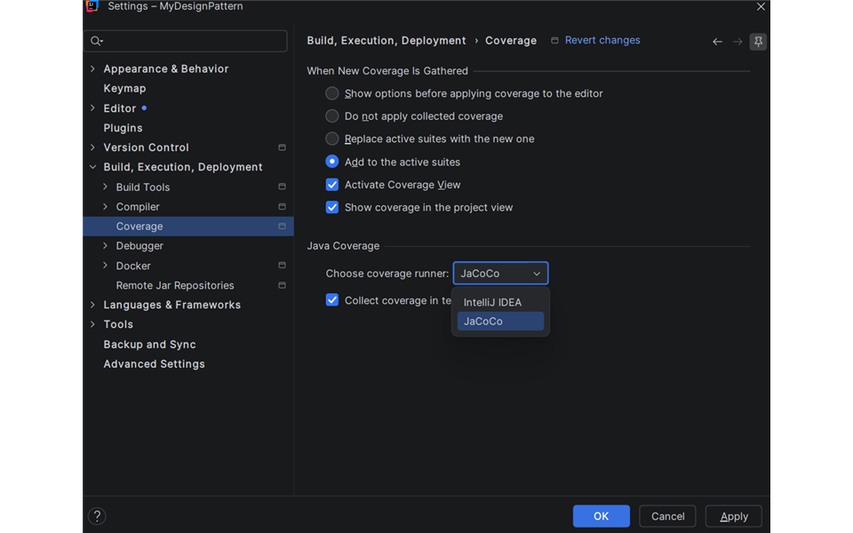
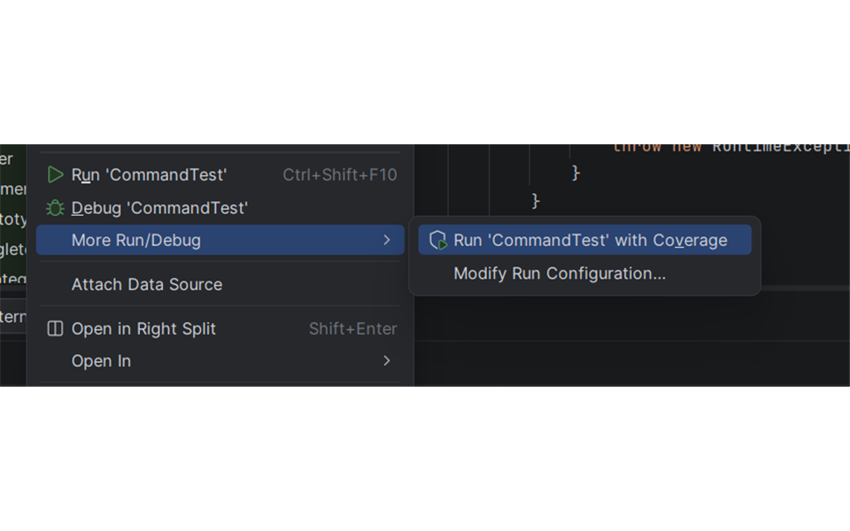
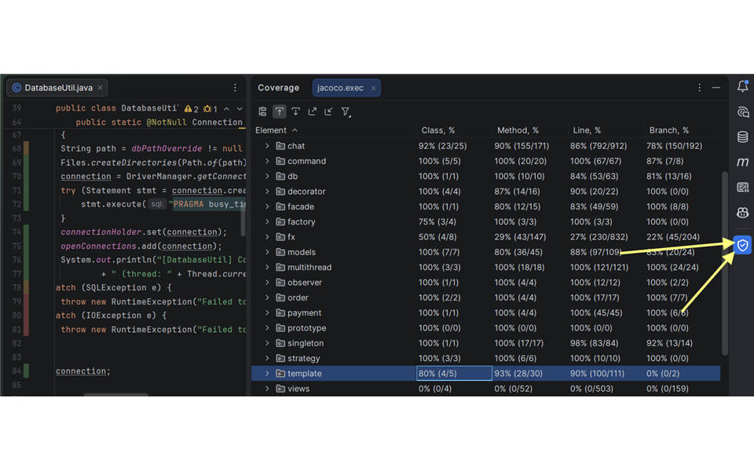
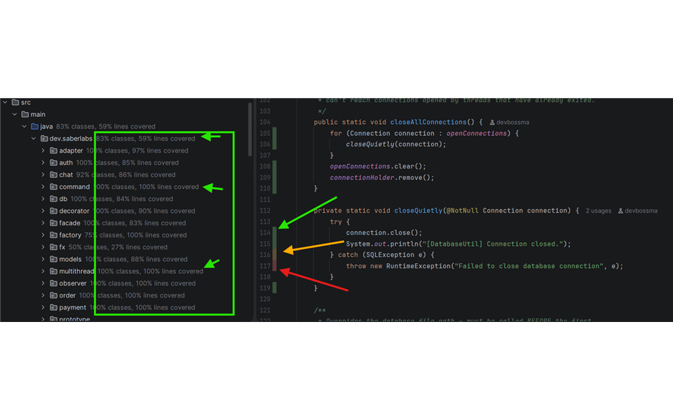
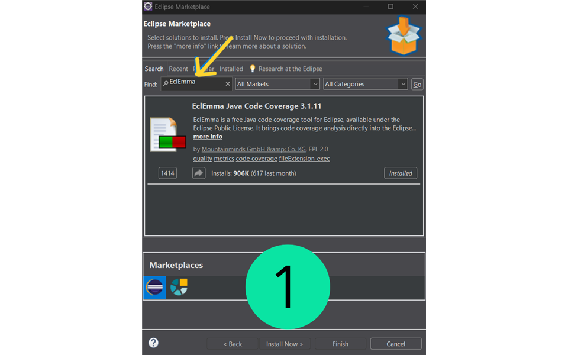
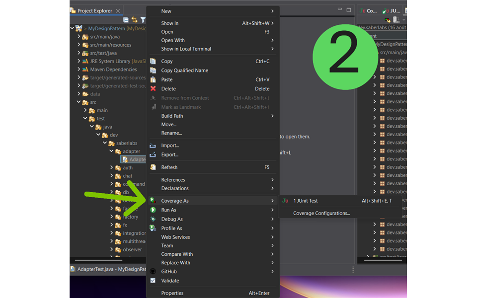
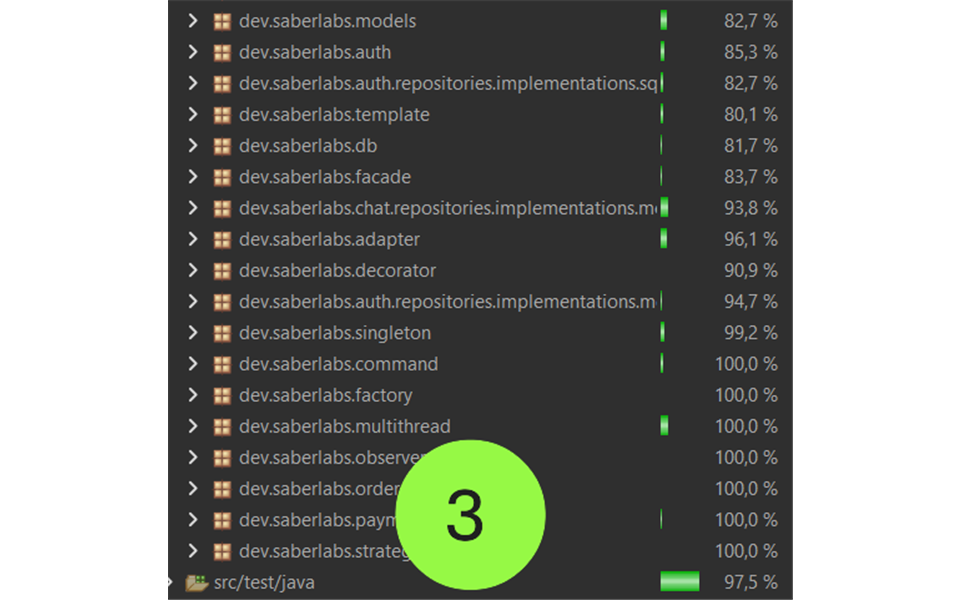
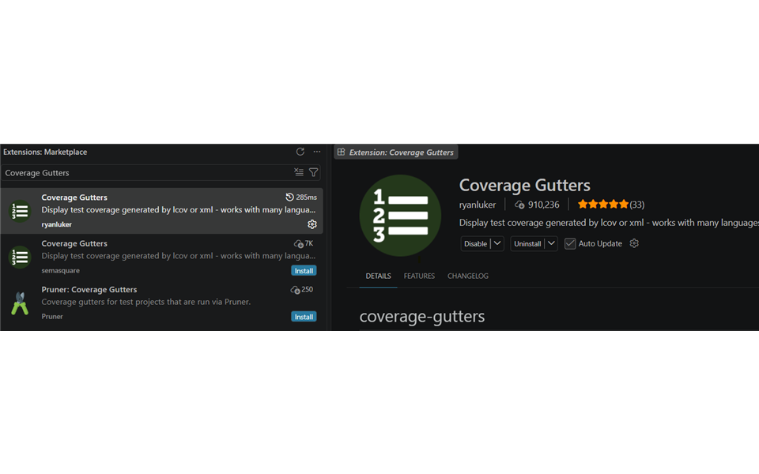
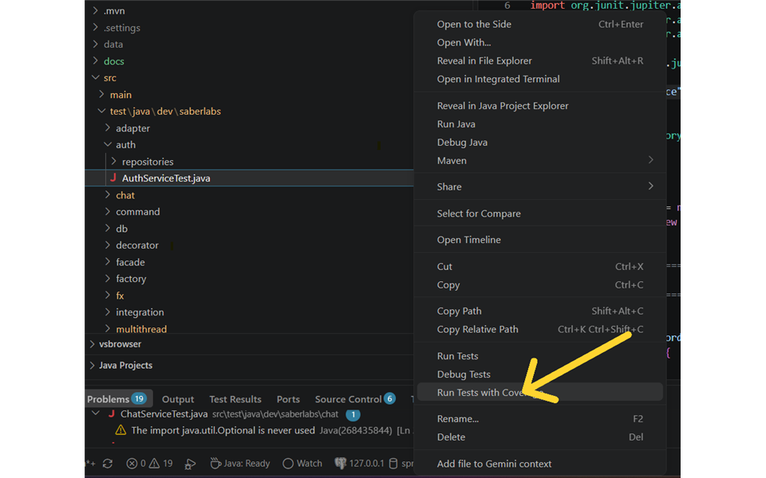
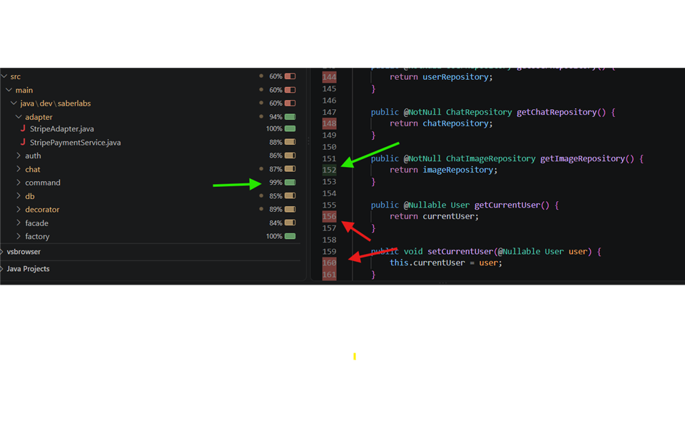

# Welcome to Package It
***

## Task
A coffee shop simulation started as a pure design-patterns exercise, grew into a
concurrent order-processing system, then into a full chat-based ordering application
with a JavaFX desktop client and a JUnit/Mockito/JaCoCo safety net and now needs to
leave the IDE entirely: something an evaluator can build once and run without cloning
the project into their own editor. Each phase had its own core challenge:

### Quick Reminder of the previous Project Phases:

- **Design Patterns phase**  implement all 10 assigned GoF patterns *correctly*, not
  as superficial approximations, and make them cooperate inside one cohesive
  application rather than existing as isolated textbook examples.
  see [`DESIGN-PATTERNS-README.md`](docs/DESIGN-PATTERNS-README.md) for full details.

- **Multithreading phase**  extend the same application so multiple customers can
  place orders concurrently while baristas prepare them in the background, using a
  thread-safe order queue (the classic producer-consumer problem) without corrupting
  shared state like loyalty tiers or order counters.
  see [`MULTITHREADING-README.md`](docs/MULTITHREADING-README.md) for full details.

- **Coffee Chat phase**  extend it again with a real chat feature  a CLI chat app
  (`CoffeeChatAppCLI`) where orders are placed *through conversation* and paid for as
  an explicit step, persisted via a handwritten JDBC layer, then wrapped in a JavaFX
  desktop UI (`CoffeeChatAppFX`) with chat bubbles, image sharing, and multi-window
  support. Full details in [`COFFEE-CHAT-README.md`](docs/COFFEE-CHAT-README.md).

- **It Works On My Machine phase**  stop trusting that the previous phases still
  work just because they compile  add a real JUnit 5 + Mockito test suite (375
  tests) across order processing, chat, database interactions, and the `CoffeeShop`
  singleton lifecycle, isolating units from collaborators they don't own while
  keeping real SQLite/in-memory fakes wherever that's more informative than a mock,
  then enforce an 80% per-package line-coverage floor with JaCoCo so the suite can't
  quietly rot. Full details in
  [`IT-WORKS-ON-MY-MACHINE-README.md`](docs/IT-WORKS-ON-MY-MACHINE-README.md).

- **Package It phase (this project)**  turn everything built so far  the chat
  backend, the JavaFX desktop client, and the test suite  into something that
  doesn't require a dev environment to run or review: one self-contained,
  executable JAR built with Maven, plus HTML test and coverage reports generated
  automatically alongside it.

## Description
This phase doesn't change application behavior  the coffee shop, the chat feature,
the JavaFX UI, and the test suite are exactly as described in
[`IT-WORKS-ON-MY-MACHINE-README.md`](docs/IT-WORKS-ON-MY-MACHINE-README.md) and the
phases before it. What it adds is a real *build*: `mvn clean package` now produces one
JAR that runs anywhere Java 25 is installed, and `mvn verify` leaves behind reports
that prove the tests actually ran and the coverage floor actually holds.

### Packaging: why maven-shade-plugin, not maven-jar-plugin or maven-assembly-plugin
Before this phase, `maven-jar-plugin` was configured with `addClasspath=true` and
`classpathPrefix=lib/`  the manifest told the JVM to look for every dependency
(SQLite JDBC, the JavaFX modules) in a sibling `target/lib/` folder, but nothing in
the build ever populated that folder. `java -jar` against that jar would fail the
moment it tried to load a JavaFX or SQLite class.

Two ways to actually fix that: populate `target/lib/` with `maven-dependency-plugin`'s
`copy-dependencies` goal, or build one self-contained jar with every dependency
embedded. The assignment's own example command 
`java -jar target/coffee-shop-app-1.0-SNAPSHOT.jar`, a single file, nothing beside it
 is a self-contained jar, so that's what this project builds.

Between the two common ways to build one, **`maven-shade-plugin`** was chosen over
**`maven-assembly-plugin`**'s `jar-with-dependencies` descriptor because of what this
project's specific dependency set does when merged. This app pulls in 12 dependency
jars for one build (5 JavaFX modules, each resolving both a platform-neutral jar *and*
a Windows-native-classified jar automatically through OpenJFX's own OS-activated Maven
profiles, plus SQLite JDBC and the JetBrains annotations jar)  and several of them
collide on the same file path: every jar contributes its own `META-INF/MANIFEST.MF`,
and both the annotations and SQLite jars ship a versioned
`META-INF/versions/9/module-info.class`. `jar-with-dependencies` has no per-file
merge/exclude configuration of its own  it just unpacks every jar into one directory
and silently overwrites on collision, and getting any control over that means
abandoning the simple `descriptorRef` for a fully custom assembly descriptor.
`maven-shade-plugin` gave direct, visible control instead: a `<filters>` block
excluding `module-info.class` and signature files (`META-INF/*.SF`/`.DSA`/`.RSA`) per
artifact, and a `<transformers>` block (`ManifestResourceTransformer`) that sets the
merged jar's `Main-Class` explicitly rather than leaving it to whichever dependency's
manifest happens to win the overwrite race. The build log confirms the conflict was
real, not hypothetical  before the `module-info.class` filter was tightened to
`**/module-info.class` (the versioned copies live under a nested path, not the jar
root), `mvn clean package` reported it directly:
```bash
[WARNING] ..., annotations-26.1.0.jar, ..., sqlite-jdbc-3.53.2.0.jar define 1 overlapping classes:
[WARNING]   - META-INF.versions.9.module-info
```
`dev.saberlabs.CoffeeShopApp`  a plain launcher class that is *not* a
`javafx.application.Application` subclass, just a `main()` that calls
`CoffeeChatAppFX.main(args)`  stays the shaded jar's `Main-Class`. That pattern
exists specifically to dodge the classic "JavaFX runtime components are missing"
error, which happens when the JVM's Main-Class check sees an `Application` subclass
launched without `--module-path`; a plain launcher on the classpath sidesteps it
entirely.

### Test reports
`maven-surefire-report-plugin` was added, bound to the `test` phase, so every
`mvn test`/`verify`/`package` also writes a human-readable HTML test report to
`target/site/surefire-report.html`  a per-class pass/fail breakdown, sitting right
next to JaCoCo's own HTML report at `target/site/jacoco/index.html`. Between the two,
a reviewer can open both reports in a browser without running anything themselves.

### Known issues / possible improvements
- The shaded jar embeds whichever native JavaFX classifier Maven resolved *at build
  time*  `win` on this machine, via OpenJFX's OS-activated profiles. It's not
  cross-platform: building on macOS/Linux would embed that OS's native classifier
  instead, and a jar built on one OS won't run on another. A fully cross-platform
  distributable would need OS-specific build profiles or a tool like `jlink`/
  `jpackage` rather than one shared classifier.
- `target/` (the built jar, JaCoCo/Surefire reports) stays gitignored in this
  repository on purpose  it's a build output, not source  and is submitted
  separately as its own artifact through the course's grading platform rather than
  committed here.

## Installation
Requires **JDK 25+** and **Maven**. Same repository as the previous phases  no new
dependencies to install manually; the packaging plugins (`maven-shade-plugin`,
`maven-surefire-report-plugin`) are pulled in automatically via Maven.

```bash
git clone https://github.com/devbossma/Qwasar-Silicon-Valley-My-Design-Pattern.git
cd my_coffee_chat
mvn clean install
```

## Usage
### Running the application
Directly from source, exactly as in the previous phases  see
[`COFFEE-CHAT-README.md`](docs/COFFEE-CHAT-README.md) for the full console
(`CoffeeChatAppCLI`) and desktop (`CoffeeChatAppFX`) walkthroughs, or run
`mvn javafx:run`.

### Building and running the packaged JAR
```bash
mvn clean package
java -jar target/coffee-shop-app-1.0-SNAPSHOT.jar
```
`mvn clean package` runs the full test suite and coverage report, then builds one
self-contained JAR (~22 MB  every dependency, including the JavaFX native libraries,
is embedded). No separate `lib/` folder, classpath setup, or `--module-path` flag is
needed  `java -jar` on its own boots the JavaFX desktop client directly.

### Running the tests
```bash
mvn test
```
Runs the full suite and generates a coverage report at `target/site/jacoco/index.html`
and a test report at `target/site/surefire-report.html` (no coverage gate  this just
runs the tests and reports the numbers).

### Enforcing the coverage gate
```bash
mvn verify
```
Runs the full suite **and** fails the build if any (non-excluded) package falls below
80% line coverage:
```bash
[INFO] Results:
[INFO] 
[INFO] Tests run: 375, Failures: 0, Errors: 0, Skipped: 0
[INFO] BUILD SUCCESS
```
If a package fails the gate, the console prints exactly which one and by how much:
```bash
[WARNING] Rule violated for package dev.saberlabs.example: lines covered ratio is 0.55, but expected minimum is 0.80
```

### Measuring Test Coverage
`mvn test`/`mvn verify` already produce IDE-agnostic reports at
`target/site/jacoco/index.html` (open directly in a browser), `jacoco.xml`, and
`jacoco.csv`  usable regardless of editor  plus the test report at
`target/site/surefire-report.html`.

Each IDE also has its own way to run tests
with live coverage highlighting:

#### For IntelliJ
1. Configuring and running coverage is a two-step process:
- Configure the engine (IntelliJ's own or JaCoCo) under **Settings → Build, Execution, Deployment → Java Coverage**.

 

-  **Run ... with Coverage**. wright-click a test class/package → **More Run/Debug → 'Run CommandTest' With Coverage** or use the coverage icon next to the run button.
   

   

2. Coverage Results:
  - Open in the **Coverage** tool window with per-package/class percentages.

   

3. Open any covered source file to see inline green/red/yellow gutter highlighting.

   

#### For Eclipse
1. Install the **EclEmma** plugin (built on JaCoCo) via **Help → Eclipse Marketplace**.

   

2. Right-click a test class/package → **Coverage As → JUnit Test**.

   

3. Results appear in the **Coverage** view, with matching gutter highlighting in the editor.

   

#### For VS Code
1. Install the **Coverage Gutters** extension from the Extensions marketplace (or use
   the Java Extension Pack's Testing sidebar if it offers **Run Tests with Coverage**
   directly).

   

2. Run `mvn test` to generate `target/site/jacoco/jacoco.xml`, then run
   **Coverage Gutters: Display Coverage** from the Command Palette.
   **Right-click a test class/package → **Run Tests with Coverage**.

   

3. Gutter highlighting appears directly in the editor next to the line numbers.

   

### The Core Team


<span><i>Made at <a href='https://qwasar.io'>Qwasar SV -- Software Engineering School</a></i></span>
<span></span>
